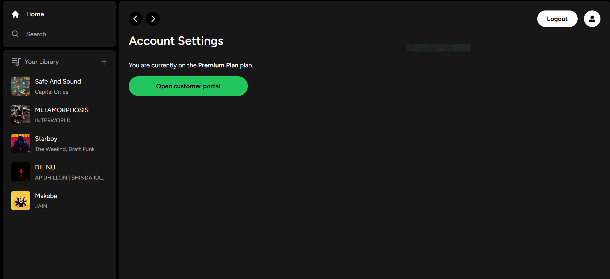
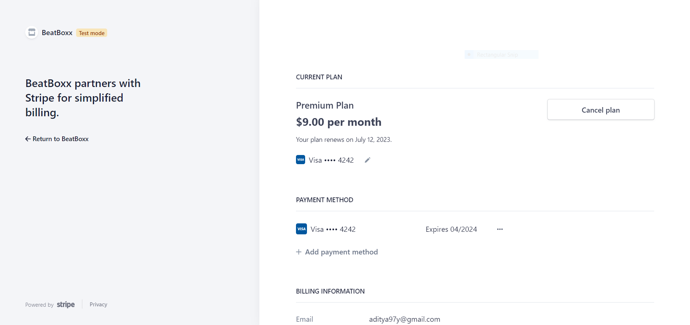

Forked from Beatboxxx.

### Beatboxx | Music Web Application

Welcome to the Music Web Application repository! This project aims to provide users with a feature-rich, fully responsive music streaming platform similar to Spotify. Users can discover, listen to, and upload their own songs seamlessly on any device. The application is built using Next.js13, React, TypeScript, and Supabase, offering a delightful and consistent user experience across various screen sizes.


## Features

- ML embeddings system for music recommendations
- Generative AI used for stem extraction, album art generation


## Screenshots


 **Add songs by clicking on plus button in my library** 

Liked songs page


**Handle Subscription in my account**



**Full Responsive**


## Tech Stack

- **Next.js:** A React framework for server-side rendering and building scalable web applications.
- **React:** A popular JavaScript library for building user interfaces.
- **TypeScript:** A typed superset of JavaScript that enhances code quality and developer productivity.
- **Supabase:** An open-source Firebase alternative that provides a backend-as-a-service (BaaS) platform for data storage, authentication, and real-time functionalities.
- **Stripe:** A widely-used payment gateway for securely handling subscription payments and transactions.
- **Tailwind CSS:** A highly customizable CSS framework that provides utility classes for building responsive and modern user interfaces.
- **PostgreSQL:** An open-source relational database management system used for storing and managing the application's data.

## Installation

 1. Clone the repository:

 ```bash
  git clone https://github.com/IsaacBell/Stem-Space.git
 ```
2. Configure the app:    
```bash
 cd Stem-Space
 npm install
```
3. Set up environment variables:  

 - Create a `.env.local` file in the root directory.

4. Run the application:
```bash
npm run dev
```
5. Open your browser and visit `http://localhost:3000` to access the application.

## Gitpod Setup

Common Issues:

```powershell
[Gorse][Request] POST https://8087-isaacbell-fullstackmusi-k4bf2x74hut.ws-us107.gitpod.io/user {"X-API-Key":"test"} {"UserId":"bob","Labels":["Rap","Techno"]}
[Gorse][Error] POST https://8087-isaacbell-fullstackmusi-k4bf2x74hut.ws-us107.gitpod.io/user 401:Unauthorized {}

 ⨯ GorseException
    at eval (webpack-internal:///(rsc)/./node_modules/gorsejs/dist/client.js:35:23)
    at process.processTicksAndRejections (node:internal/process/task_queues:95:5)
    at async insertMLUserEmbedding (webpack-internal:///(rsc)/./libs/gorseClient.ts:20:45)
    at async _demo (webpack-internal:///(rsc)/./app/api/ml/embeddings/route.ts:12:15)
    at async POST (webpack-internal:///(rsc)/./app/api/ml/embeddings/route.ts:45:5)
    at async /workspace/Full-Stack-Music-Web-App/node_modules/next/dist/compiled/next-server/app-route.runtime.dev.js:6:62609 {
  code: 401
}
```

Fix this by making the following ports public:

- 3000
- 8087
- 8088
- 8089
- 8090

## Debugging

```typescript
fetch("/api/ml/embeddings", {
  method: "POST",
  headers: { "Content-Type": "application/json" },
  body: JSON.stringify({type: 'user', data: {UserId: 'bob', Labels: ['Rap', 'Techno']} }),
});
fetch("/api/ml/embeddings/123", {
  method: "GET",
  headers: { "Content-Type": "application/json" },
});
fetch("/api/mail", {
  method: "POST",
  headers: { "Accept": "application/json", "Content-Type": "application/json" },
  body: JSON.stringify(
    {to: 'isaacbell388@gmail.com', msg: 'blah', subject: 'Yes', from: 'blah@thesoapstone.net'}),
});
```